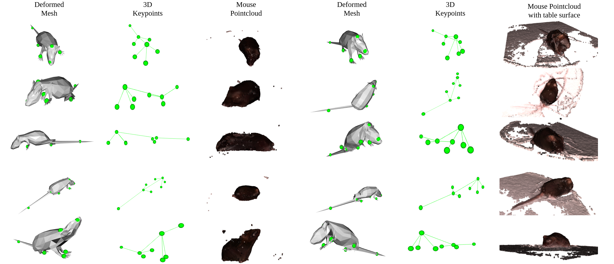
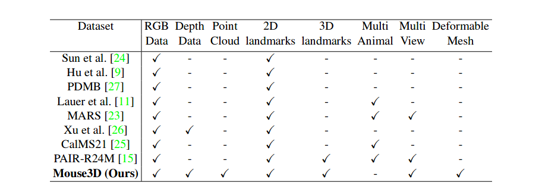
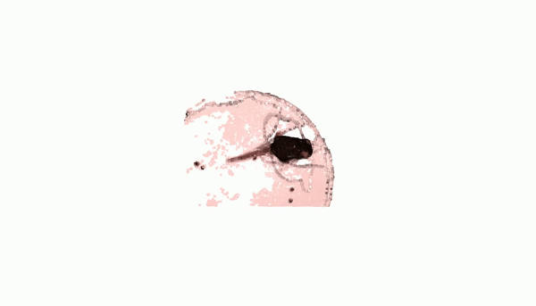
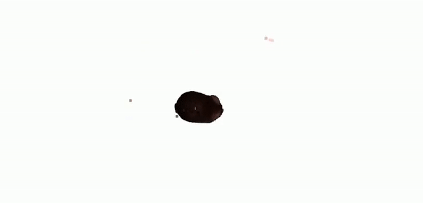
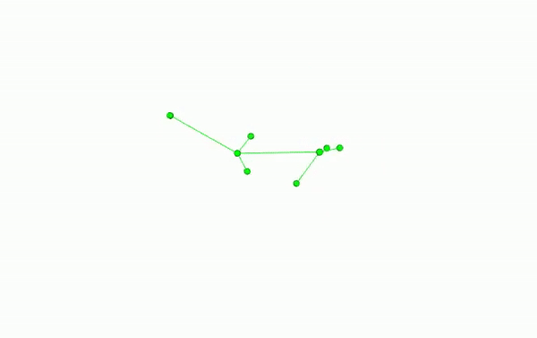
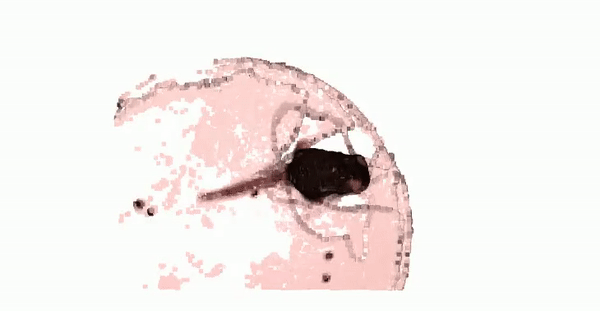

## A Comprehensive Multiview Dataset for Mice Behaviors

### Abstract

<i>With a few exceptions, existing computer vision solu-
tions for tracking animals are built upon a 2D represen-
tation while motor behaviors, including foraging, locomo-
tion, and social interactions, are by large performed in 3D.
This mismatch often introduces limited expressibility when
generalizing to complex interactions that involve significant
occlusion, viewpoint changes, and pose variations. In this
paper, we address this challenge by presenting a new 3D
multiview dataset called Mouse3D—42,685 3D deformable
meshes of mice controlled by a set of 3D landmarks that
are fitted to 3D multiview point cloud measurements. A
key challenge of obtaining a full 3D mesh is to handle oc-
clusion, e.g., the body parts that are behind the torso. We
address this challenge by fusing multiview RGB-D images
where the noisy point cloud from each view is combined
to form a clean point cloud via truncated signed distance
function (TSDF) fusion. With the fused point cloud and the
triangulated landmarks from multiview images, we deform
the mesh such that it can best explain the point cloud and
3D landmarks. We anticipate that Mouse3D will provide a
new opportunity for neuroscience by scaling-up mouse 3D
tracking.</i>

### Compared to exisiting datasets

### Dataset Details

_No of Unique Mice - 15_

- **RGB-D Frames** - 256,110
- **2D Landmarks** - 256,110
- **Mouse Point clouds** - 42,685
-  **3D Landmarks** - 42,685
-  **Deformed Meshes** - 42,685

### Examples
|  |  |
| -------------- | -------------- |
|  |  |

**Download dataset [here](url)** (_link will be active soon..._)
